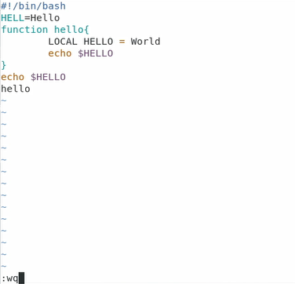
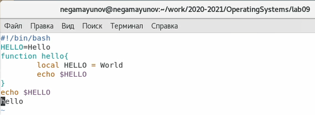
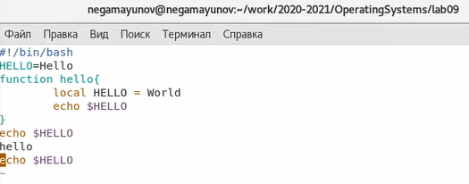

<!-- _class: titleslide -->
# Лабораторная работа №9
### Выполнил Гамаюнов Никита, 1032201719, НПМбд-01-20

---
# Прагматика выполнения работы
**Цель:** Познакомиться с операционной системой Linux. Получить практические навыки работы с редактором vi, установленным по умолчанию практически во всех дистрибутивах.

**Задача:** Создать и отредактировать созданный файл с помощью vi.

---

# Процесс выполнения работы. Задание 1

1. Вызвал vi и создал файл `hello.sh`.

2. Перешёл в режим вставки нажатием `i`, затем ввёл текст

    

---
3. В режиме последней строки нажал `w` (записать) и `q` (выйти), а затем - `Enter` для сохранения текста и завершения работы 

    

4. Сделал файл исполняемым

    

---
# Задание 2
1. Заменил `HELL` на `HELLO`

    

2.  Вставил последнюю строку, содержащую следующий текст: `echo $HELLO` 

    

---
3. Удалил последнюю строку и вернул её, введя `u`

    

    

После этого завершил работу, сохранив файл (`:wq`)

---

<!-- _class: titleslide -->
# Выводы
Я познакомился с операционной системой Linux. Получил практические навыки работы с редактором vi, установленным по умолчанию практически во всех дистрибутивах.