
 

# Лабораторная работа №9 

**По дисциплине Операционнные системы** 

Выполнил Гамаюнов Н.Е., студент ФФМиЕН РУДН, НПМбд-01-20, 1032201717

Преподаватель Кулябов Дмитрий Сергеевич

Москва, 2021 г.

 

# Цель работы
Познакомиться с операционной системой Linux. Получить практические навыки работы с редактором vi, установленным по умолчанию практически во всех дистрибутивах.

# Задания
Создать и отредактировать созданный файл с помощью vi.

# Выполнение лабораторной работы
## Задание 1. Создание нового файла с использованием vi
1. Создал каталог `work/2020-2021/OperatingSystems/lab09` *(рисунок 1)*

**в методических материалах было сказано создать каталог с именем lab06, но, видимо, материал просто слегка устарел, так что назвал его по номеру текущей лабораторной*

2. Перешёл в ранее созданный каталог *(рисунок 1)*

    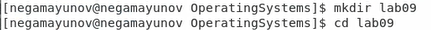

    Рисунок 1.

3. Вызвал vi и создал файл `hello.sh` *(рисунок 2)*

    

    Рисунок 2.

4. Перешёл в режим вставки нажатием `i`, затем ввёл текст *(рисунок 3)*

    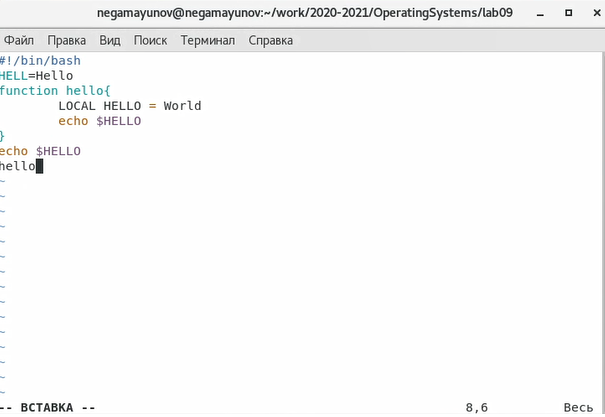

    Рисунок 3.

5. Нажал `Esc1`, чтобы вернуться в коммандный режим *(рисунок 4)*

    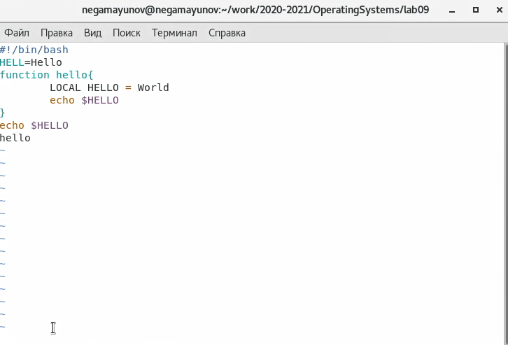

    Рисунок 4.

6. Нажатием `:` перешёл в режим последней строки *(рисунок 5)*

    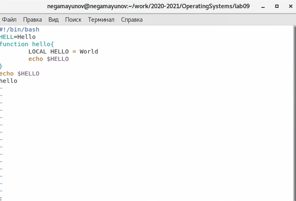

    Рисунок 5.

7. Нажал `w` (записать) и `q` (выйти), а затем - `Enter` для сохранения текста и завершения работы *(рисунок 6)*

    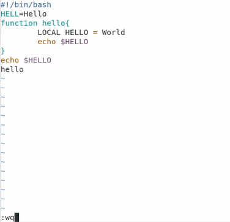

    Рисунок 6.

8. Сделал файл исполняемым *(рисунок 7)*

    

    Рисунок 7.

---

##  Задание 2. Редактирование существующего файла

1. Вызвал vi на редактирование файла *(рисунок 8)*

    

    Рисунок 8.

2. Установил курсор в конец слова `HELL` второй строки *рисунок 9)*

    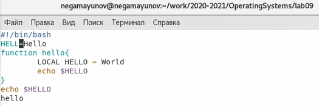

    Рисунок 9.

3. Перешёл в режим вставки и заменил на `HELLO`. Нажал `Esc` для возврата в командный режим *(рисунок 10)*

    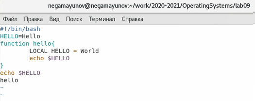

    Рисунок 10.

4. Установив курсор на четвёртой строке, стёр слово `LOCAL` *(рисунок 11)*

    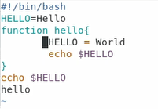

    Рисунок 11.

5. Перешёл в режим вставки и ввёл следующий текст: `local`, нажал `Esc` для возврата в командный режим (рисунок 12)*

    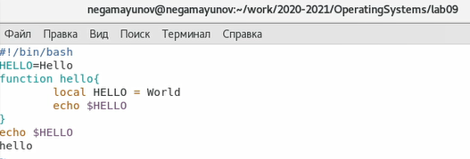

    Рисунок 12.

6. Установил курсор на последней строке файла. Вставил после неё строку, содержащую следующий текст: `echo $HELLO` *(рисунок 13)*

    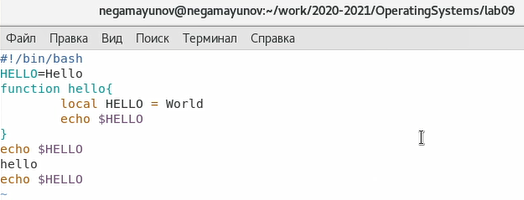

    Рисунок 13.

7. Нажал `Ecs` для перехода в командный режим.
8. Удалил последнюю строку *(рисунок 14)*

    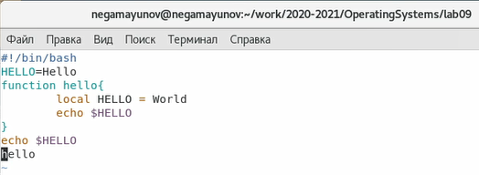

    Рисунок 14.

9. Ввёл команду отмены изменений `u` для отмены последней команды *(рисунок 15)*

    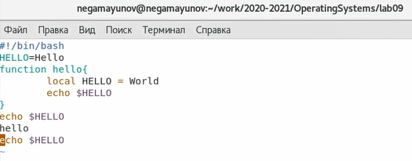

    Рисунок 15.

10. Ввёл символ `:` для перехода в режим последней строки. Записал произведённые изменения с помощью `w` и вышёл из vi, используя `q` *(рисунок 16)*

    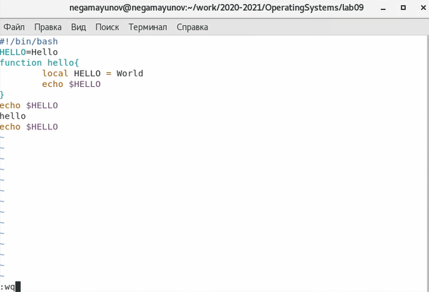

    Рисунок 16.

# Выводы
Я познакомился с операционной системой Linux. Получил практические навыки работы с редактором vi, установленным по умолчанию практически во всех дистрибутивах.

# Ответы на контрольные вопросы

1. В vi есть три режима работы:
- командный режим — предназначен для ввода команд редактирования и навигации по редактируемому файлу;
- режим вставки — предназначен для ввода содержания редактируемого файла;
- режим последней (или командной) строки — используется для записи изменений в файл и выхода из редактора.
2. В режиме последней строки ввести `q` без `w`.
3. Команды позиционирования:
- `0 (ноль)` — переход в начало строки;
- `$` — переход в конец строки;
- `G` — переход в конец файла;
- `n G` — переход на строку с номером n.
4. Последовательность символов без разделителей
5. Перейти в начало - `1`. Перейти в конец - `G`.
6. 213
7. Команды редактирования:
   
- **Вставка текста**
  - `а` — вставить текст после курсора;
  - `А` — вставить текст в конец строки;
  - `i` — вставить текст перед курсором;
  - `n i` — вставить текст n раз;
  - `I` — вставить текст в начало строки.
  
- **Вставка строки**
  - `о` — вставить строку под курсором;
  - `О` — вставить строку над курсором.
- **Удаление текста**
  -  `x` — удалить один символ в буфер;
    - `d w` — удалить одно слово в буфер;
    - `d $` — удалить в буфер текст от курсора до конца строки;
    - `d 0` — удалить в буфер текст от начала строки до позиции курсора;
    - `d d` — удалить в буфер одну строку;
    - `n d d` — удалить в буфер n строк.
- **Отмена и повтор произведённых изменений**
    - `u` — отменить последнее изменение;
    - `.` — повторить последнее изменение.
- **Копирование текста в буфер**
  - `Y` — скопировать строку в буфер;
  - `n Y` — скопировать n строк в буфер;
  - `y w` — скопировать слово в буфер.
- **Вставка текста из буфера**
  - `p` — вставить текст из буфера после курсора;
  - `P` — вставить текст из буфера перед курсором.
- **Замена текста**
  - `c w` — заменить слово;
  - `n c w` — заменить n слов;
  - `c $` — заменить текст от курсора до конца строки;
  - `r` — заменить слово;
  - `R` — заменить текст.
- **Поиск текста**
  - `/ текст` — произвести поиск вперёд по тексту указанной строки символов
текст;
  - `1 текст` — произвести поиск назад по тексту указанной строки символов

8. Сначала нажму `nG`, где n - номер строки, чтобы перейти на неё, потом `0`, чтобы перейти в начало конец, и `с$$`, чтобы заменить текст от курсора до конца строки на $. 
9. `w` - записать. Если после `w` написать имя файла, текст созранится в новый файл с этим именем. Если после поставить `!`, текст запишется в существующий файл с этим именем.
    
    `q` - выйти. Если поставить `!` после, то выйти без записи. Если ввести `wq`, выйти и записать.

10. `$` - переместиться в конец строки. Далее на экране (справа внизу) можно увидеть два числа: первое - номер строки, второе - позиция, в которой она заканчивается.
11. Опции редактора vi позволяют настроить рабочую среду. Для задания опций используется команда set (в режиме последней строки):
 - `: set all` — вывести полный список опций;
  - `: set nu` — вывести номера строк;
  - `: set list` — вывести невидимые символы;
  - `: set ic` — не учитывать при поиске, является ли символ прописным или строчным.

    Если вы хотите отказаться от использования опции, то в команде set перед именем опции надо поставить no.
12. В режиме вставки снизу окна можно заметить `ВСТАВКА`. В режиме последней строки снизу слева будет `:`. Если внизу экрана пусто, режим командный.
13.    
 

# Библиография
- [Кулябов Д. С. и др. Операционные системы. Методические рекомендации к лабораторной работе №6](https://esystem.rudn.ru/pluginfile.php/1142084/mod_resource/content/2/006-lab_vi.pdf)